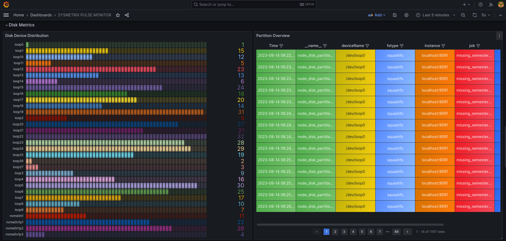

# SysMetrix Pulse Monitor

SysMetrix Pulse Monitor is a simple system activity monitor that collects various statistics and displays them in real-time. This project focuses on monitoring CPU, memory, and disk usage, allowing users to gain insights into their system's performance. Whether you're a system administrator, developer, or curious user, SysMetrix Pulse Monitor provides a user-friendly interface to keep track of essential metrics.

## Features

- **Real-time Monitoring**: SysMetrix Pulse Monitor collects and displays system metrics in real-time with a refresh rate of 1-5 seconds.

- **CPU Metrics**: Monitor overall CPU usage, free CPU capacity, and usage per application or process.

- **Memory Metrics**: Track total memory usage, available memory, and memory usage per application or process.

- **Disk Metrics**: Keep an eye on disk devices and partitions, along with read and write rates.

- **Search Functionality**: Filter and search metrics based on application or process names.

## Getting Started

Follow these steps to build and run SysMetrix Pulse Monitor on your system:

1. Install Go 1.20: [Installation Guide](https://go.dev/doc/install)

2. Install Prometheus: [Installation Guide](https://www.cherryservers.com/blog/install-prometheus-ubuntu)
   - Start Prometheus:
     ```
     sudo systemctl enable prometheus
     sudo systemctl start prometheus
     ```

3. Install Grafana: [Download Grafana](https://grafana.com/grafana/download)
   - Start Grafana Server:
     ```
     sudo systemctl daemon-reload
     sudo systemctl start grafana-server
     ```

4. Clone the repository:
    ```
     git clone git@github.com:Ayoubbooob/system-activity-monitor_v2.git
     ```

5. Navigate to the project directory:
    ```
    cd system-activity-monitor_v2
    ```

6. Run the monitor:
    ```
    go run main.go
    ```
    

    - Access Prometheus metrics: [http://localhost:9091/metrics](http://localhost:9091/metrics)
    - Visualize metrics in Grafana: [http://localhost:3000](http://localhost:3000)

## Screenshots

### CPU Metrics
- Real-time CPU Usage Overview


- CPU Usage Over Time, App & Process-specific CPU Utilization


### Memory Metrics
- Memory Motion: Utilization and Availability Over Time


- App & Process-specific Memory Utilization


### Disk Metrics
- Disk Device Distribution & Partition Overview


- Disk Read Rate per App


- Disk Write Rate per App


### Prometheus UI
- Display of collected metrics in Prometheus web interface


### Jenkins Pipeline
- Successful execution of the Jenkins pipeline


### Demo GIF
- A GIF showcasing the application in action


## Verification Checklist

- [x] `README.md` with build instructions
- [x] Builds on Linux / Linux VM
- [x] Used one of the allowed programming languages (Golang)
- [x] Monitor CPU:
- [x] Current total usage
- [x] Current usage per application
- [x] Current free
- [x] Monitor Memory:
- [x] Current total usage
- [x] Current total free
- [x] Current usage per application
- [x] Monitor Disk:
- [x] Available devices
- [x] Available partitions
- [x] Read rate per application
- [x] Write rate per application
- [x] Real-time stats collection
- [x] UI:
- [x] Prometheus + Grafana

## Accepted Output Devices

SysMetrix Pulse Monitor offers two ways to view collected statistics:

### Prometheus + Grafana

The monitor can send data to a Prometheus instance and visualize metrics through Grafana. To explore metrics, visit [http://localhost:3000](http://localhost:3000).

Happy monitoring!

---

This project was created as part of the [SysMetrix Hackathon](https://example.com).


